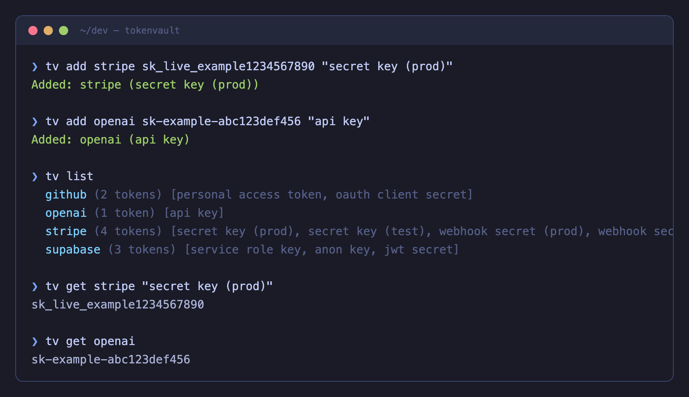

# tokenvault

> Encrypted token store for developers. Single file, zero dependencies, git-synced.

<p align="center">
	<br>
	
	<br>
</p>

Manage your API tokens and secrets from the terminal. AES-256 encrypted, stored in a git repo, decrypted with a local master key. Push `tokens.enc` anywhere — without the key, it's unreadable.

Single Python file. No pip install. No virtual env. Just works.

## Install

```sh
git clone https://github.com/saadnvd1/tokenvault && cd tokenvault && bash install.sh
```

Then generate your master key:

```sh
tv init
```

## Usage

```sh
tv add stripe sk_live_example123 "secret key (prod)"
tv add stripe whsec_xyz789 "webhook secret"
tv get stripe                     # prints all tokens for project
tv get stripe "secret key (prod)" # prints specific token
tv list                           # all projects
tv list stripe                    # tokens for project (masked)
tv remove stripe "webhook secret" # remove one token
tv remove stripe                  # remove all for project
tv dump                           # full decrypted JSON
```

## How it works

1. `tv init` generates a 256-bit master key at `~/.config/tokenvault/master.key`
2. `tv add` encrypts all tokens with AES-256-CBC via openssl and writes `tokens.enc`
3. `tokens.enc` is safe to commit and push — it's encrypted
4. `master.key` stays local, never committed

That's it. Single Python file, stdlib only.

## Sync across machines

```sh
# On the new machine:
git clone https://github.com/saadnvd1/tokenvault && cd tokenvault && bash install.sh

# Copy the master key from your first machine:
scp user@first-machine:~/.config/tokenvault/master.key ~/.config/tokenvault/master.key
chmod 600 ~/.config/tokenvault/master.key
```

Now `tv get` works on both machines. Push/pull `tokens.enc` via git to sync.

## Use with AI coding agents

Point any AI coding agent (Claude Code, Codex, etc.) at the tokenvault directory and it can fetch tokens on its own:

```sh
# In your project's CLAUDE.md or agent instructions:
# "API keys are stored in ~/dev/tokenvault. Use `tv get <project> [desc]` to fetch tokens."
```

Agents can also use `tv dump` for a full JSON view or `tv list` to discover what's available. Output is pipe-safe — colors auto-disable when redirected, so `tv get openai "api key"` returns a clean value for scripts and subshells.

```sh
# In a script or .env setup:
export OPENAI_API_KEY=$(tv get openai "api key")
export STRIPE_SK=$(tv get stripe "secret key (prod)")
```

#### Alias in your shell

The installer creates `tv` at `~/bin/tv`. If you prefer a different location:

```sh
ln -sf /path/to/tokenvault/tokenvault.py /usr/local/bin/tv
```

## FAQ

#### Is this secure?

Tokens are encrypted with AES-256-CBC + PBKDF2 via openssl. The encrypted file is safe to push to GitHub. Security depends on your master key staying private — treat it like an SSH key.

#### Why not use a password manager?

Password managers are designed for web logins. tokenvault is designed for API tokens — things you `export` in shell scripts, paste into `.env` files, and reference in CI/CD configs. Different workflow.

#### Why not use environment variables?

Env vars work for one machine. tokenvault works across machines via git sync. It's also searchable — `tv list` shows everything, `tv get project` finds what you need instantly.

#### Does it work on Linux?

Yes. Requires Python 3 and openssl (both pre-installed on most Linux distros).

## Related

- [Keyring Vault](https://saadnaveed.com/keyring-vault) — macOS menu bar app for tokenvault. Touch ID, search, one-click copy.

## License

MIT
