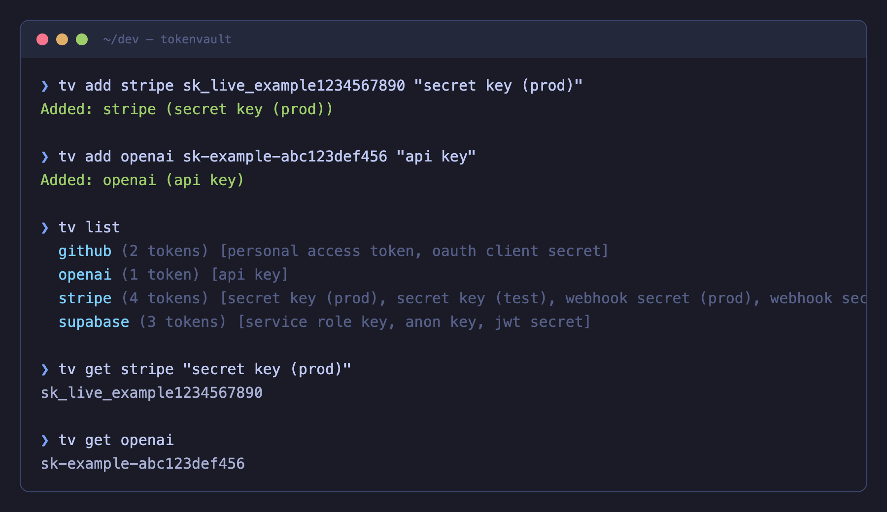

# tokenvault

> Encrypted token store for developers. Single file, zero dependencies, git-synced.

<p align="center">
	<br>
	
	<br>
</p>

Manage your API tokens and secrets from the terminal. AES-256 encrypted, decrypted with a local master key. Data at `~/.tokenvault/`, key at `~/.config/tokenvault/` — without the key, it's unreadable.

Single JS file. No dependencies. Just Node.js.

## Install

```sh
npm i -g tokenvault
```

Or clone and link:

```sh
git clone https://github.com/saadnvd1/tokenvault && cd tokenvault && npm link
```

Then generate your master key:

```sh
tv init
```

## Usage

```sh
tv add stripe sk_live_example123 "secret key (prod)"
tv add stripe whsec_xyz789 "webhook secret"
tv get stripe                     # prints all tokens for project
tv get stripe "secret key (prod)" # prints specific token
tv list                           # all projects
tv list stripe                    # tokens for project (masked)
tv remove stripe "webhook secret" # remove one token
tv remove stripe                  # remove all for project
tv dump                           # full decrypted JSON
tv audit                          # who read what, and when (never values)
```

## How it works

1. `tv init` creates a git repo at `~/.tokenvault/` and generates a master key at `~/.config/tokenvault/master.key`
2. `tv add` encrypts all tokens with AES-256-CBC (Node crypto) and writes `tokens.enc`
3. Every write auto-commits `tokens.enc` to the local git repo
4. `master.key` stays outside the repo, never committed

That's it. Single JS file, zero deps.

## Sync across machines

```sh
# First machine — set up remote:
tv remote https://github.com/you/my-tokens.git  # private repo
tv push

# Second machine:
npm i -g tokenvault
tv init
tv remote https://github.com/you/my-tokens.git
tv pull

# Copy the master key from your first machine:
scp user@first-machine:~/.config/tokenvault/master.key ~/.config/tokenvault/master.key
chmod 600 ~/.config/tokenvault/master.key
```

Now `tv get` works on both machines. Use `tv push` / `tv pull` to sync.

## Use with AI coding agents

Tell any AI coding agent (Claude Code, Codex, etc.) to use `tv` and it can fetch tokens on its own:

```sh
# In your project's CLAUDE.md or agent instructions:
# "Use `tv get <project> [desc]` to fetch API keys. Run `tv list` to see what's available."
```

Output is pipe-safe — colors auto-disable when redirected, so `tv get openai "api key"` returns a clean value for scripts and subshells.

```sh
# In a script or .env setup:
export OPENAI_API_KEY=$(tv get openai "api key")
export STRIPE_SK=$(tv get stripe "secret key (prod)")
```

## Audit log

Every `tv get` and `tv dump` appends one JSON line to
`~/.local/state/tokenvault/audit.log` (override with `TOKENVAULT_AUDIT_LOG`;
`XDG_STATE_HOME` is respected). It records **which entry was read, never its
value**:

```json
{"ts":"2026-09-16T22:50:00.000Z","cmd":"get","entries":["stripe/secret key"],"found":true,
 "pid":4242,"ppid":4241,"parents":["zsh","claude","tmux"],"cwd":"/Users/me/app",
 "claude_session":"6f1c…","agent":"task-nova-bear"}
```

- `parents` is the executable names of the parent chain, not command lines — a
  parent's argv can carry some other secret.
- `claude_session` comes from `CLAUDE_CODE_SESSION_ID` (or `CLAUDE_SESSION_ID`),
  `agent` from `WIRE_AGENT`; both are `null` when unset.
- The log is outside `~/.tokenvault/` on purpose: that directory is a git repo
  that pushes to a remote. The file is created `0600`.
- Logging is best-effort. If the log cannot be written, `tv get` still prints
  the token and exits 0.

```sh
tv audit                 # last 20 reads
tv audit -n 100
tv audit check           # print anomalies; exit 3 if there are any
tv audit check --post    # post new ones to wire, remember what was sent
```

`tv audit check` flags:

| Finding  | Rule (defaults)                                              | Flags            |
| -------- | ------------------------------------------------------------ | ---------------- |
| `dump`   | any `tv dump`                                                |                  |
| `burst`  | more than 5 distinct entries read inside 60s                 | `--max`, `--window` |
| `misses` | 3+ reads of entries that do not exist inside 60s (probing)   | `--max-misses`   |

With `--post` it sends the findings to the wire channel `tokenvault-audit`
(`--channel` or `TOKENVAULT_AUDIT_CHANNEL`; creates it if missing), as
`WIRE_AGENT=tokenvault-audit`, and stores a cursor in `audit.log.state.json`
so a finding is posted once. If the post fails the cursor is not moved and the
next run retries. `TOKENVAULT_WIRE` overrides the `wire` binary (tests use it).

### Running the check on a schedule

Run it every five minutes with [serviceman](https://github.com/saadnvd1/serviceman):

```sh
sm add tv-audit-check "/opt/homebrew/bin/node $HOME/.local/share/homelab-jobs/tokenvault/cli.js audit check --post" --cron "*/5 * * * *"
```

On Saad's Mac, cron jobs must run pushed code from a job checkout, never
`~/dev`, so this belongs in `homelab/box/services.toml` as a `mac_jobs` entry
rather than a hand-added `sm` job:

```toml
{ name = "tv-audit-check", cmd = "/bin/zsh -c 'source ~/.zshenv; exec /opt/homebrew/bin/node \"$HOME/.local/share/homelab-jobs/tokenvault/cli.js\" audit check --post'", cron = "*/5 * * * *", checkouts = ["tokenvault"] },
```

then `box/homelab apply --mac` and `box/homelab check`. `~/.zshenv` supplies
`WIRE_REMOTE`/`WIRE_TOKEN_FILE`, so the post reaches the box's wire store.

## Tests

```sh
npm test
```

Zero deps: `node --test`. The CLI tests run `cli.js` against a throwaway
`HOME`, vault and log.

## FAQ

#### Is this secure?

Tokens are encrypted with AES-256-CBC + PBKDF2 via Node's built-in crypto module. The encrypted file is safe to push to GitHub. Security depends on your master key staying private — treat it like an SSH key.

#### Why not use a password manager?

Password managers are designed for web logins. tokenvault is designed for API tokens — things you `export` in shell scripts, paste into `.env` files, and reference in CI/CD configs. Different workflow.

#### Why not use environment variables?

Env vars work for one machine. tokenvault works across machines via git sync. It's also searchable — `tv list` shows everything, `tv get project` finds what you need instantly.

#### Does it work on Linux?

Yes. Requires Node.js 16+ (uses built-in crypto, no native deps).

## Related

- [Keyring Vault](https://saadnaveed.com/keyring-vault) — macOS menu bar app for tokenvault. Touch ID, search, one-click copy.

## License

MIT
